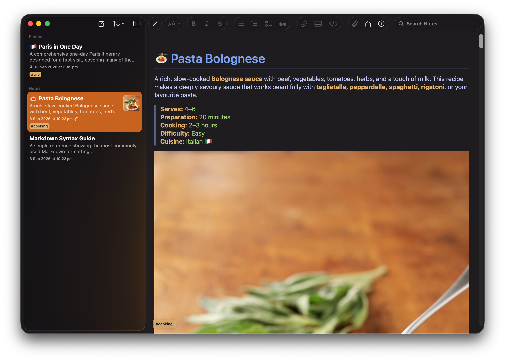
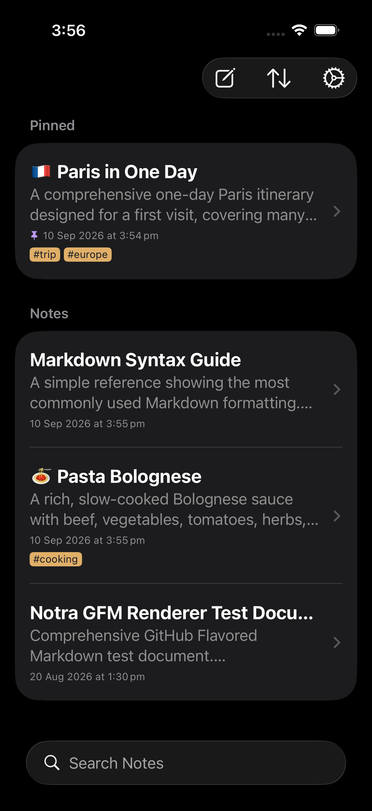
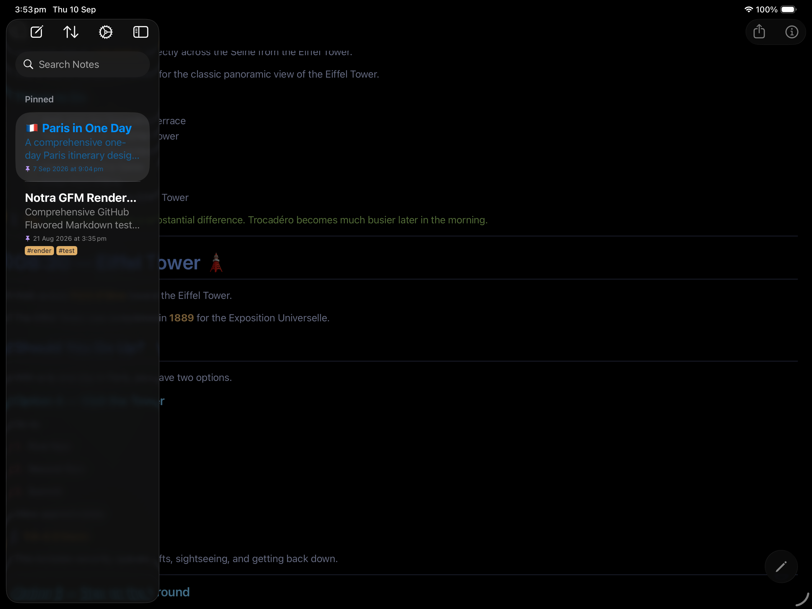

# Notra

Notra is a SwiftUI notes app for iOS, iPadOS, and macOS. Notes are stored as TextBundle documents with Markdown content and local assets.

## Screenshots

Notra keeps the same focused writing workflow across Apple devices.

<p align="center">
  
</p>

<p align="center">
  
  
</p>

See the [privacy policy](docs/privacy.html) used for the App Store submission.

## Requirements

- Xcode 27 with iOS 27 and macOS 27 SDKs
- SwiftFormat and SwiftLint available on your PATH

## Build

Run validation builds before opening a pull request:

```sh
make build
```

This builds iOS first, then macOS. To build one platform at a time:

```sh
make build-ios
make build-macos
```

The build targets run SwiftFormat and SwiftLint in lint mode before compiling.

## Run

The run scripts launch the latest Debug app built by the matching build target and stream logs:

```sh
make build-ios
make run-ios
make run-ios-ipad
make build-macos
make run-macos
```

`make run-ios` uses the iPhone 17 simulator on iOS 27. The iOS run targets use simulators. For a physical iPhone or iPad, open `Notra.xcodeproj` in Xcode and run the `Notra` scheme on the device.

## Local Signing and iCloud

The public project uses local-only storage by default and does not include a personal Apple Developer Team ID or iCloud container.

For private local signing, copy `Config/LocalSigning.xcconfig.example` to `Config/LocalSigning.xcconfig` and set your own values. The local file is ignored by git.

For private iCloud development:

```sh
cp Config/LocalSigning.xcconfig.example Config/LocalSigning.xcconfig
cp Config/LocalInfo-iCloud.plist.example Config/LocalInfo-iCloud.plist
```

Then replace the placeholder values with your own Apple Developer Team ID, bundle identifier, and iCloud container. Both local files are ignored by git.

Build scripts default to unsigned builds. Override signing explicitly when building:

```sh
CODE_SIGNING_ALLOWED=NO make build-macos
CODE_SIGNING_ALLOWED=YES make build-ios
```

## Contributing

Use focused branches and keep changes small. Before opening a pull request, run both build scripts and make sure there are no warnings, SwiftFormat issues, or SwiftLint violations.

Install the local pre-commit privacy hook before your first commit:

```sh
Scripts/install_git_hooks.sh
```

The hook blocks staged local signing files, iCloud identifiers, Apple Developer Team IDs, credentials, private keys, crash reports, logs, databases, local Xcode state, and local user paths. It also reads your ignored local signing config at runtime and blocks those private values if they accidentally appear in staged files.

Do not commit local signing configuration, generated build output, crash reports, logs, personal notes, or private data.
