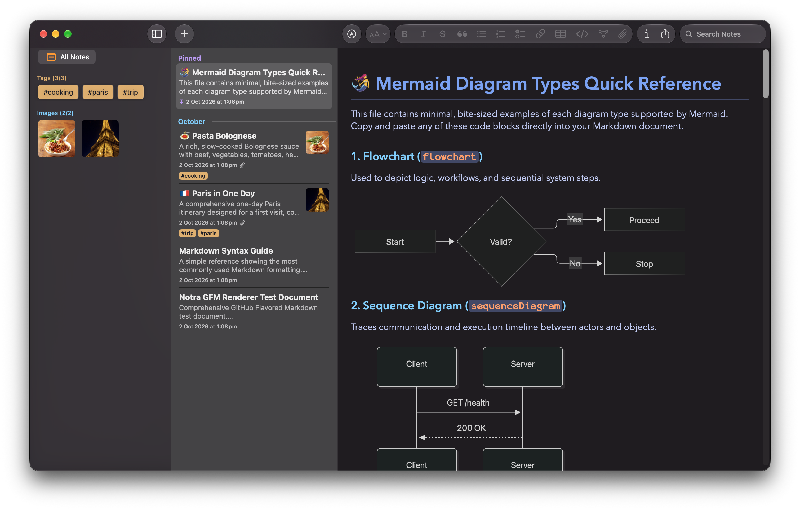
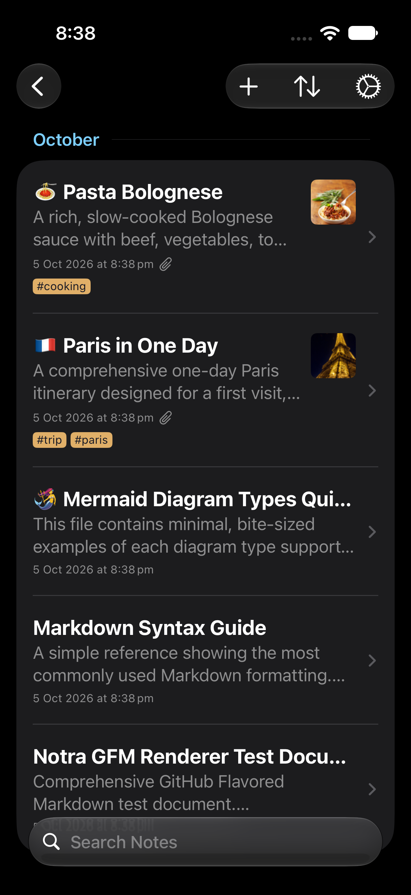

# Notra

Notra is a SwiftUI notes app for iOS, iPadOS, and macOS. Notes are stored as TextBundle documents with Markdown content and local assets.

## Download

### Free Mac development build

[Download a development build from GitHub Releases](https://github.com/akopulko/notra/releases) to try Notra's editing and organisation features.

- Requires an **Apple silicon Mac (M1 or later)** running **macOS 26 or later**. Intel Macs are not supported by GitHub downloads.
- Notes are stored **locally only**, without iCloud sync.
- Signed with an **Apple Development certificate**, but **not notarised**. macOS may block the first launch.
- Install **Notra Preview.app** separately from the full App Store edition. Download updates manually from Releases.

### Full App Store edition

[Get Notra on the App Store](https://apps.apple.com/app/notra-markdown-notes/id6809414279) for **Mac, iPhone, and iPad**, with local storage and iCloud sync using your own iCloud storage. **One purchase. No subscription.**

<p>
  <a href="https://apps.apple.com/app/notra-markdown-notes/id6809414279">
    
  </a>
</p>

| | GitHub development build | App Store edition |
|---|---|---|
| Devices | Apple silicon Mac only | Mac, iPhone, iPad |
| Storage | Local only | Local and iCloud |
| Installation | ZIP download; security approval may be required | App Store |
| Updates | Manual download | App Store |
| Price | Free | One-time purchase |

The source remains open source, including the optional iCloud configuration for developers building with their own signing credentials. GitHub downloads do not impose a time limit or note limit.

### Installing a development build

1. Download the ZIP and `SHA256SUMS.txt` from the same release. In their download folder, run `shasum -a 256 -c SHA256SUMS.txt`.
2. Extract the ZIP and move **Notra Preview.app** to Applications. Do not replace **Notra.app** from the App Store.
3. Try opening the preview. If macOS blocks it, review [Apple's instructions for opening an app from an unknown developer](https://support.apple.com/guide/mac-help/open-a-mac-app-from-an-unknown-developer-mh40616/mac).
4. If you trust this download, use **System Settings → Privacy & Security → Open Anyway** when offered. Managed Macs may prohibit this exception.

Development signing is not notarization or App Review. Do not disable Gatekeeper globally or remove quarantine attributes to install the preview.

### Moving notes to the App Store edition

The editions use separate sandbox libraries and preferences. **Preview notes do not migrate automatically.**

1. Let your notes finish saving. In each edition, use **Settings → General → Open Library Location** to reveal its active library.
2. Back up both libraries, then quit both apps.
3. Copy complete `.textbundle` documents from the preview backup into the Store edition's library. Keep their `assets` folders; copying only Markdown can lose attachments. Do not overwrite existing bundles.
4. Relaunch the Store edition and verify the notes and attachments before deleting any preview data. If its active library uses iCloud, also verify sync on your other device.

Preferences and other app-level state are not transferred by copying TextBundles.

## Sidebar organisation

On iOS, iPadOS, and macOS, unpinned notes are grouped by month in the current year and by year otherwise. Headings use the system calendar, time zone, and locale. **Date Edited** or **Date Created** selects the grouping date; **Latest First** or **Oldest First** controls section and row order. Pinned notes stay first, ordered by their pin timestamps.

Section headings use semibold headline text with a native horizontal divider extending after the title. **Pinned** uses the Markdown theme's italic colour; month and year headings use its h3 colour. Colours adapt to light and dark appearance.

Filter-only browsing keeps date sections. Typing a search query uses the **Pinned** and **Notes** sections instead, preserving search relevance within unpinned results.

The leading sidebar lists tags shared by notes, ordered by how many notes use each tag. It shows the ten most-used tags with **Show All** to expand the list to at most 100; **Show Less** returns to ten. Each note can have up to ten tags. Select one or more tags to show notes matching **any** selection; the list intersects that filter with text search. On compact iPhone layouts, use the sidebar navigation button to switch between tag filters and notes.

The **Images** section contains linked local images from the whole library. Tapping a thumbnail reveals its owning row and clears filters only if they hide that note. On iOS and iPadOS, this only scrolls the notes list; tap the row to select and open the note. On macOS, the thumbnail also selects and opens its owning note.

The revealed row briefly zooms to 108% scale and back with a spring animation, without a background fill or outline. Each thumbnail tap replays the effect, including another image from the same note. **Reduce Motion** disables the zoom.

## Markdown import on macOS

Use **File → Import…** to select one or more Markdown files. Each file becomes a separate note; importing the same file again creates another note.

## Markdown diagrams

Mermaid fenced blocks render locally in the preview and PDF export. The bundled Mermaid 12.0.0 runtime works offline; its upstream MIT license is included with the app resources. Diagram source stays editable Markdown and is preserved in Markdown exports. Use **Insert Mermaid Diagram** in the editor toolbar or iOS keyboard accessory to add a starter flowchart.

## Screenshots

Notra keeps the same focused writing workflow across Apple devices.

<p align="center">
  
</p>

<p align="center">
  
  
</p>

See the [privacy policy](docs/privacy.html) used for the App Store submission.

## Requirements

- Xcode 27 with iOS 27 and macOS 27 SDKs
- SwiftFormat and SwiftLint available on your PATH

## Build

Run validation builds before opening a pull request:

```sh
make build
```

This builds iOS first, then macOS. To build one platform at a time:

```sh
make build-ios
make build-macos
```

The build targets run SwiftFormat and SwiftLint in lint mode before compiling.

## Continuous integration and unit tests

`.github/workflows/ci.yml` runs for pull requests targeting `master` and pushes to `master`. It uses `dorny/paths-filter` v4 in Git mode with inline filters, requiring no separate filter file or PR API permission. Changes confined to `docs/` skip app validation; the lightweight **CI result** check still completes so required checks do not block website-only pull requests. Changes outside `docs/`, including mixed app/website changes, run the full validation.

CI uses GitHub's [`xcode-27` preview runner](https://github.com/actions/runner-images/issues/14404), currently running macOS 27, and explicitly selects Xcode 27.0. It checks SwiftFormat and SwiftLint, builds iOS simulator/device targets, runs unit tests on iPhone 17 with iOS 27.0, then builds and tests macOS natively. Platform builds and test runs are sequential. Compiler and linker warnings are treated as errors.

The workflow has read-only repository access, pins actions to full commit SHAs, does not persist checkout credentials, and requires no Apple signing secrets. Version comments identify each pinned release; unlike tags such as `v7`, these references cannot move to different code. CI does not run UI tests or change the separate Pages deployment. Configure branch protection on `master` to require **CI result**, not the conditionally skipped validation job.

Unit-test commands live directly in `ci.yml`, with no extra helper scripts or Python files. They use the shared `Notra` scheme, select only `NotraTests`, and use the public local-only configuration without personal signing credentials. `NotraUITests` remains available in Xcode but is not executed by CI. Run the `NotraTests` target in Xcode for local unit testing.

Search-dependent store tests require confirmed index readiness before querying. A monotonic deadline reports stalled or unavailable indexing as a readiness failure instead of a missing search result.

## Publishing GitHub development releases

`.github/workflows/release-macos.yml` runs only for pushed version tags such as `v1.3` or `v1.3.1`. It requires the tagged commit to belong to `master`, the app's Release marketing version to match the tag, and successful master CI for that exact commit. It produces only arm64 binaries; App Store architecture settings remain unchanged.

The workflow builds an optimised, local-only app with the public configuration, stages **Notra Preview.app**, and signs it without a provisioning profile using an Apple Development identity in a temporary keychain. Sandbox and hardened-runtime protection remain enabled; debugger access and iCloud entitlements are absent. It uploads only the ZIP and checksum, stages and verifies a draft, then automatically publishes a **prerelease**. Apple credentials are unavailable to the publishing job.

### One-time owner setup

1. In **Xcode → Settings → Accounts → Manage Certificates**, create or select an **Apple Development** identity. Control-click it, choose **Export Certificate**, and save a password-protected `.p12` outside the repository. The export must include its private key.
2. In GitHub **Settings → Environments**, create or update **macos-preview**. Configure a required reviewer. If you are the only reviewer, leave **Prevent self-review** unchecked. Restrict deployments using **Selected branches and tags → Tag → `v*`**.
3. Add these **environment secrets**, not variables:

   | Secret | Value |
   |---|---|
   | `MACOS_DEVELOPMENT_CERTIFICATE_P12_BASE64` | Base64-encoded Apple Development `.p12` |
   | `MACOS_DEVELOPMENT_CERTIFICATE_PASSWORD` | The `.p12` export password |

   To copy the encoded identity, run this from the folder containing it:

   ```sh
   rtk proxy base64 -i Notra-AppleDevelopment.p12 | rtk proxy pbcopy
   ```

   Paste into the first secret's Value field. Base64 is not encryption; keep the exported identity and password private. No App Store Connect API key, notarization key, iCloud secret, provisioning profile, or personal access token is needed.

4. Under **Settings → Rules → Rulesets**, protect tags matching **`v*`**. Use one active tag ruleset restricting creation, with bypass for authorised releasers, and a separate active ruleset restricting updates/deletions without routine bypass. Keep **CI result** required on `master`.

Signing certificates necessarily expose their public identity, potentially including the developer name and Team ID, in the distributed app. Private keys and passwords must never enter Git, release assets, or logs. Replace the environment identity before its certificate expires.

### Each release

1. Merge the reviewed app version/build update and workflow changes through `dev` into `master`. Wait for successful CI on the exact commit to release.
2. From a clean worktree, create an unused tag matching the app version:

   ```sh
   rtk git switch master
   rtk git pull --ff-only origin master
   rtk git tag v1.3
   rtk git push origin v1.3
   ```

3. Open the release run under **Actions**, select **Review deployments**, and approve **macos-preview**. Publication is automatic after all checks succeed.
4. Download `Notra-Preview-v1.3-macOS-arm64.zip` and `SHA256SUMS.txt` through a browser. Verify the checksum, first launch on an Apple silicon Mac not registered for development, local note persistence, attachments, and coexistence with the Store edition. Check manual note transfer using temporary fixtures before recommending it to users.

Never move an existing version tag or overwrite a published release. If publication fails after creating a draft, inspect and delete only that incomplete draft before rerunning the same workflow; retain its tag. The guard intentionally rejects any existing release for the tag.

App Store uploads, iCloud credentials, and App Store Connect configuration are not changed by this workflow.

## Run

The run targets build the selected Debug app before launching it and stream logs. If the ignored `Config/LocalSigning.xcconfig` exists, they sign the build automatically; otherwise they use an unsigned build:

```sh
make run-ios
make run-ios-ipad
make run-macos
```

`make run-ios` uses the iPhone 17 simulator on iOS 27. The iOS run targets use simulators. For a physical iPhone or iPad, open `Notra.xcodeproj` in Xcode and run the `Notra` scheme on the device.

To override the automatic signing choice:

```sh
CODE_SIGNING_ALLOWED=NO make run-macos
CODE_SIGNING_ALLOWED=YES make run-ios
```

## Local Signing and iCloud

The public project uses local-only storage by default and does not include a personal Apple Developer Team ID or iCloud container.

For private local signing, copy `Config/LocalSigning.xcconfig.example` to `Config/LocalSigning.xcconfig` and set your own values. The local file is ignored by git.

For private iCloud development:

```sh
cp Config/LocalSigning.xcconfig.example Config/LocalSigning.xcconfig
cp Config/LocalInfo-iCloud.plist.example Config/LocalInfo-iCloud.plist
```

Then replace the placeholder values with your own Apple Developer Team ID, bundle identifier, and iCloud container. Both local files are ignored by git.

Build scripts default to unsigned builds. Override signing explicitly when building:

```sh
CODE_SIGNING_ALLOWED=NO make build-macos
CODE_SIGNING_ALLOWED=YES make build-ios
```

## Contributing

Use focused branches and keep changes small. Before opening a pull request, run both build scripts, run `NotraTests` in Xcode, and make sure there are no warnings, SwiftFormat issues, SwiftLint violations, or failing unit tests.

Install the local pre-commit privacy hook before your first commit:

```sh
Scripts/install_git_hooks.sh
```

The hook blocks staged local signing files, iCloud identifiers, Apple Developer Team IDs, credentials, private keys, crash reports, logs, databases, local Xcode state, and local user paths. It also reads your ignored local signing config at runtime and blocks those private values if they accidentally appear in staged files.

Do not commit local signing configuration, generated build output, crash reports, logs, personal notes, or private data.

Apple, the Apple logo, Mac, iPhone, and iPad are trademarks of Apple Inc., registered in the U.S. and other countries. App Store is a service mark of Apple Inc. The official download badge is used under [Apple's marketing guidelines](https://developer.apple.com/app-store/marketing/guidelines/).
